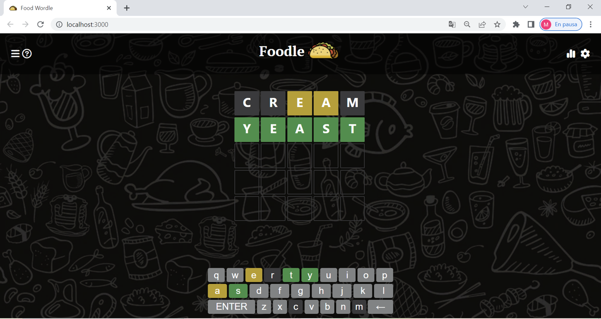

# Foodle

This project is a frontend app based on the known game of The New York Times, Wordle, aimed to find different names of dishes or food each time you play.

## Technologies

This project is currently fullstack and was created using:

-Languages: Javascript, HTML

-Styling: CSS, Bootstrap

-Framework: ReactJS

-Components: Antd, React-Simple-Keyboard

Here's a quick Visual.

## Get Started

To get started in the project directory you may run:

### `npm install`

### `npm start`

Runs the app in the development mode.\
Open [http://localhost:3000](http://localhost:3000) to view it in your browser.

The page will reload when you make changes.\
You may also see any lint errors in the console.

# Thank you!
